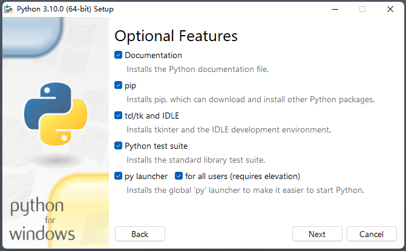
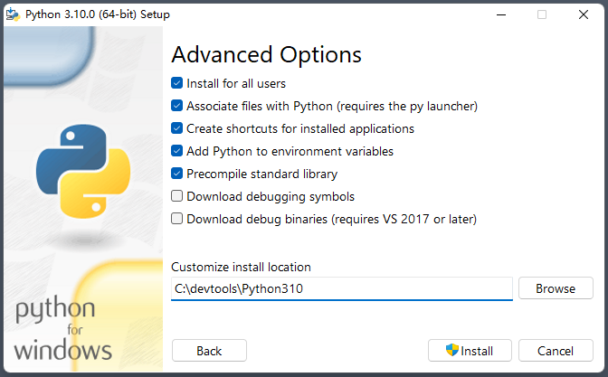
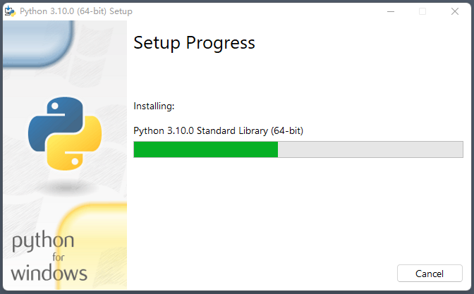
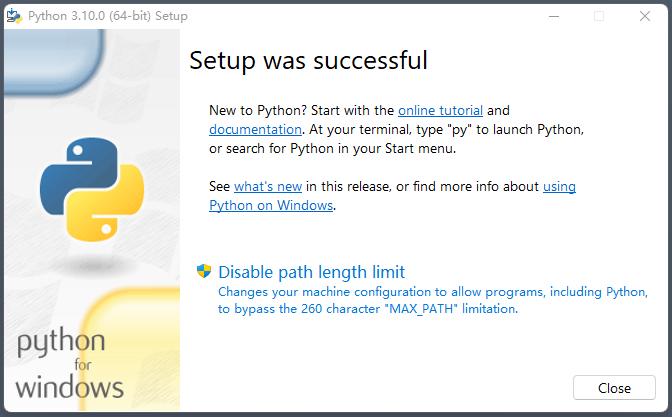
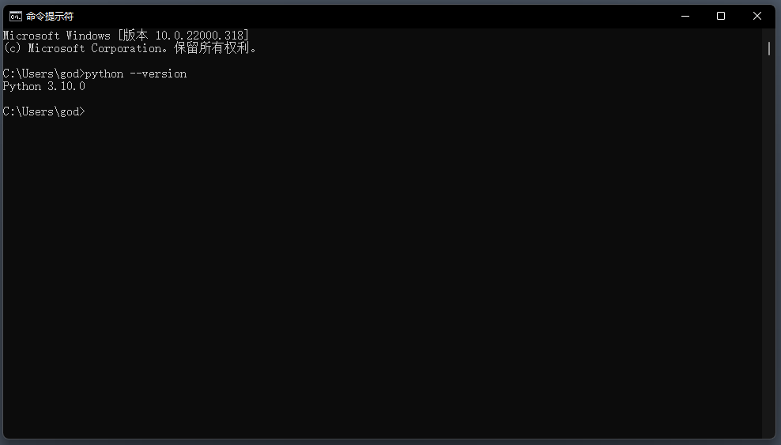

# Python 环境安装

本文以截图记录的形式展示如何在主流操作系统上安装 Python 环境。

在 Python 环境选择上，推荐使用较新的 Python 版本。根据[官方发布消息](https://www.python.org/doc/sunset-python-2/) ，
自 2020年 1 月 1 日起， Python 2 将停止维护，包括任何新的错误报告、修复和更改。
所以强烈建议你在版本选择上使用 Python 3.7 之后的版本。考虑到 Python 3 各个版本的新特性和兼容性，
建议选择 Python 3.9 或 Python 3.10 。

截止到当前时间（2021-12-03）， Python 各个版本的状态如下：

| Branch | Schedule | Status   | First release | End-of-life |
| ------ | -------- | -------- | ------------- | ----------- |
| main   | PEP 664  | features | 2022-10-03    | 2027-10     |
| 3.10   | PEP 619  | bugfix   | 2021-10-04    | 2026-10     |
| 3.9    | PEP 596  | bugfix   | 2020-10-05    | 2025-10     |
| 3.8    | PEP 569  | security | 2019-10-14    | 2024-10     |
| 3.7    | PEP 537  | security | 2018-06-27    | 2023-06-27  |
| 3.6    | PEP 494  | security | 2016-12-23    | 2021-12-23  |

本文安装的版本使用最新的稳定版 `python 3.10` ，会在如下操作系统上安装：

- Windows 11 ： 安装包安装
- Ubuntu Desktop 21 ： 源代码编译安装

从 [Python 下载页面](https://www.python.org/downloads/) 找到 [Python 3.10 的下载页面](https://www.python.org/downloads/release/python-3100/) 然后下载对应的文件即可。

## 1 安装

关于 Python 的安装使用的更多细节，可以参考 [Python安装和使用](https://docs.python.org/zh-cn/3/using/index.html) 。

### 1.1 Windows 11

#### 1.1.1 安装 Python 环境

下载 [Windows installer(64-bit)](https://www.python.org/ftp/python/3.10.0/python-3.10.0-amd64.exe) 到本地，然后双击运行安装文件。

注意：安装时，需要账户控制权限。

[](../assets/images/install/windows-install-setup.png)

如果想要将 Python 安装到默认目录，直接点击 `Install Now` 即可。

点击 `Customize Installation` :

[](../assets/images/install/windows-install-optional-features.png)

此时可以选择可选的特性，不过还不是你不知道它们是做什么的，或者不清楚你是否需要它们，那么保持默认即可。
然后点击 `Next` ：

[](../assets/images/install/windows-install-advanced-options.png)

然后进行如下操作：

- 勾选 `Install for all users` 将 Python 安装为所有用户可用
- 勾选 `Add Python to environment variables` 将会自动创建 Python 的环境变量。此选项会在 Windows 环境 `PATH` 中新增两个变量 `C:\devtools\Python310\Scripts\` 和 `C:\devtools\Python310\` 。目录为 Python 的安装目录。
- 如果有需要，修改 `Customize install location` 下的安装路径。

然后点击 `Install` ，将 Python 安装到指定的目录。此过程需要账户授权。

[](../assets/images/install/windows-install-setup-progress.png)

等待安装完成后，点击 `Close` 。当然建议点击 `Disable path length limit` ，来禁用 Windows 下的 260 字节文件
路径的限制。

[](../assets/images/install/windows-install-successful.png)

至此安装完成。

更多关于 Windows 系统的其他细节，请参考 [在Windows上使用 Python](https://docs.python.org/zh-cn/3/using/windows.html) 。

#### 1.1.2 测试 Python 环境

打开 Windows 的 CMD ，然后输入 `python --version` 即可获得 Python 版本：

[](../assets/images/install/windows-test-python.png)

### 1.2 Ubuntu Desktop 21

对于编译安装，适用于大部分 Linux 系统，除了 Python 安装过程中的依赖包在特定操作系统中有区别外，其他操作都是一致的。

#### 1.2.1 安装依赖

```bash
sudo apt-get install build-essential gdb lcov pkg-config \
      libbz2-dev libffi-dev libgdbm-dev libgdbm-compat-dev liblzma-dev \
      libncurses5-dev libreadline6-dev libsqlite3-dev libssl-dev \
      lzma lzma-dev tk-dev uuid-dev zlib1g-dev
```

#### 1.2.2 安装 Python 环境

下载 [XZ compressed source tarball](https://www.python.org/ftp/python/3.10.0/Python-3.10.0.tar.xz) 源码包，然后解压到 `/tmp` ，
然后解压：

```bash
cd /tmp/
wget https://www.python.org/ftp/python/3.10.0/Python-3.10.0.tar.xz
tar -Jxf Python-3.10.0.tar.xz
cd Python-3.10.0/
```

使用 ./configure 进行预编译。在预编译过程中，可以指定要编译到源代码中的内容。使用 ./configure --help 可以查看支持哪些选项。

一般会进行如下操作：

```bash
./configure --enable-optimizations
```

如果需要安装到其他位置，可以使用 --prefix=/usr/bin 指定。默认是安装到 /usr/local/bin 。

当出现如下输出，说明预编译完成：

```text
creating Modules/Setup.local
creating Makefile
```

编译
使用 make 命令编译构建

```bash
make -s -j2
```

-j 可以指定并发构建任务数。如果多核 CPU 可以指定核心数。

安装

```bash
sudo make altinstall
```

使用 altinstall 可以避免覆盖系统现有默认命令。即不会覆盖 python 命令。

#### 1.2.3 测试 Python 环境

打开终端，运行 `python3.10 --version` 会输出 Python 的版本。

至此 Python 环境安装完成。

更多关于 Unix 系统的其他细节，请参考 [在类Unix环境下使用Python]( https://docs.python.org/zh-cn/3/using/unix.html) 。

## 2 仓库加速

鉴于国内网络的问题，为了快速安装 Python 依赖包，最好使用国内镜像仓库加速 [Pypi](https://pypi.org/)  的包。

Pypi 国内镜像有很多，现在推荐如下几个：

- [清华 mirror](https://mirrors.tuna.tsinghua.edu.cn/help/pypi/)
- [阿里云 mirror](https://developer.aliyun.com/mirror/pypi?spm=a2c6h.13651102.0.0.3e221b11o3zdGt)
- [163 mirror](https://mirrors.163.com/.help/pypi.html)

下面使用阿里云镜像配置，如果需要使用其他镜像仓库，改动 `index-url` 后面的地址即可：

```bash
pip config set global.index-url https://mirrors.aliyun.com/pypi/simple/
```

## 3 多环境共存

多环境共存是为了在同一个操作系统中，同时使用不同版本的 Python 环境，或者编写的程序需要在
不同版本下运行测试。

### ~~3.1 Windows~~

经测试，由于 DLL 的问题，无法通过 Windows 的 `mklink` 命令软连接一个新的 `python.exe` 可执行程序的别名。

### 3.2 Linux

Linux 本身的优势，可以使用软连接生成不同的可执行文件名。在安装好 Python 3.10 版本后，默认会在生成 `/usr/local/bin/python3.10`
可执行文件。如果需要将默认的 Python 命令替换为 `python3.10` 则可以删除原有的 `python` 命令，然后重新软连接。

```bash
# 备份当前默认的 python3 命令到 /tmp
mv /usr/bin/python3 /tmp
# 重新连接 python3 命令
ln -s /usr/local/bin/python3.10 /usr/bin/python3

# 备份当前默认 pip3 命令
mv /usr/bin/pip3 /tmp
# 重新连接 pip3 命令
ln -s /usr/local/bin/pip3.10 /usr/bin/pip3
```

## 4 问题排查

### 4.1 Linux 安装出现问题

如果编译过程中出现问题，请检查依赖是否安装完成。

Debian / Ubuntu 系列操作系统依赖如下：

```bash
sudo apt-get install build-essential gdb lcov pkg-config \
      libbz2-dev libffi-dev libgdbm-dev libgdbm-compat-dev liblzma-dev \
      libncurses5-dev libreadline6-dev libsqlite3-dev libssl-dev \
      lzma lzma-dev tk-dev uuid-dev zlib1g-dev
```

对于 RHEL 系列操作系统，依赖安装如下：

```bash
sudo dnf install dnf-plugins-core  # install this to use 'dnf builddep'
sudo dnf builddep python3
```

### 4.2 卸载 Python

注意：如果是 Linux 操作系统，你应该至少保留系统的默认 Python 环境，或者一个其他版本的 PYthon 环境，否则 操作系统可能无法正常使用。

要卸载对应版本的 Python 环境，只需要将系统根目录相关目录查找到，然后删除即可。

对于编译安装的 Python 环境，会将 Python 安装到如下几个目录：

- `/usr/lib/python3.10`
- `/usr/local/lib/libpython3.10.a`
- `/usr/local/lib/python3.10`
- `/usr/local/include/python3.10`
- `/usr/local/bin/python3.10-config`
- `/usr/local/bin/python3.10`
- `/usr/local/share/man/man1/python3.10.1`

运行命令删除：

```bash
# 创建备份目录，以便出现问题，可以执行恢复
# 注意不要在 /tmp 下创建，如果重启系统 /tmp 下的文件会删除。
# 放在家目录，可以通过应急模式找到相应文件。
# 等确保操作系统没有任何异常问题的时候，再删除
mkdir ~/removed_python310
mv -f \
    /usr/lib/python3.10 \
    /usr/local/lib/libpython3.10.a \
    /usr/local/lib/python3.10 \
    /usr/local/include/python3.10 \
    /usr/local/bin/python3.10-config \
    /usr/local/bin/python3.10 \
    /usr/local/share/man/man1/python3.10.1 \
    ~/removed_python310
```

如果你曾使用过 `pip3.10` 安装依赖，请检查用户目录下是否存在相关依赖目录：

- `/home/god/.local/lib/python3.10`
